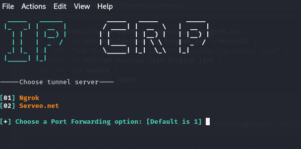

# IP CRP
Grab cam shots from target's phone front camera or PC webcam just sending a link.


## What is IP-CRP?
<p>IP-Catcher is a tool that allows you to capture the IP address of a target by hosting a fake website on a PHP server. It uses ngrok or Serveo to generate a link, which is then forwarded to the target. When the target opens the link and grants camera permissions, the tool captures their IP address.</p>


## Features
<p>The tool offers two types of servers for creating and managing the fake website:</p>
<ul>
  <li>Ngrok</li>
  <li>Serveo.net</li>
</ul>
<p>Choose the server type and template to generate a link for the target. The IP address of the target will be logged when they open the link.</p>

## Tested On:
<ul>
  <li>Kali Linux</li>
  <li>Termux</li>
  <li>MacOS</li>
  <li>Ubuntu</li>
  <li>Parrot Sec OS</li>
</ul>

## Installing and Requirements
<p>This tool requires PHP for the webserver and SSH or Serveo link. Ensure the following dependencies are installed:</p>

```
apt-get -y install php openssh git wget
```

## Installing (Kali Linux/Termux):

```
git clone https://github.com/Emerson-Portugal/IP-CRP.git
cd IP-CRP
bash script.sh
```

## Change Log:

<p><b>Version: 1.7:</b> Fix and add support</p>
<ul>
  <li>fixed: termux failed to get home directory</li>
  <li>Add support for Apple sillicon (M1/M2/M3 ARM64)</li>
  <li>Add support for arm64 like Raspberry Pi</li>
</ul>
<p><b>Version: 1.6:</b> Fix ngrok direct link generate</p>
<p><b>Version: 1.5:</b> Add new online meeting template</p>
<p><b>Version: 1.4:</b> Ngrok authtoken update</p>
<p><b>Version: 1.3:</b> Fix ngrok direct link</p>

#### For More Video subcribe <a href="http://youtube.com/emersoncrp">emersoncrp  YouTube Channel</a>


# Credits

This tool is inspired by the work of **thelinuxchoice.** We thank thelinuxchoice for their contributions and resources that made this project possible.
#### Your GitHub <a href="http://github.com/thelinuxchoice/">thelinuxchoice </a>